Setting up Google Credentials for AP Harvester
==============================================

Since Harvester relies on Google Sheets for data storage, the first step in
setting up your own Harvester is creating some Google credentials for the
system to use. There are three main pieces to this:

1. Creating and configuring a new project for Harvester on the Google Cloud
   Platform

2. Creating a service account that Harvester will use to interact with your
   data collection projects in Google Sheets

3. Creating OAuth credentials to enable authentication and authorization in
   Harvester (this is optional but recommended)

## Google Cloud Platform Project

You can set up all the necessary Google credentials using [the Google Cloud
Platform dashboard][gcp-dashboard]. If this is your first time using the
dashboard, Google might ask you to agree to some terms of service before
getting started, but then you should see a blue navbar at the top of the
dashboard with a project selection drop-down. If you haven't created any
projects you it will just say "Select a project", but if do have an existing
project then a project will automatically be selected and that project's name
will be in the drop-down. It's in the top-left:

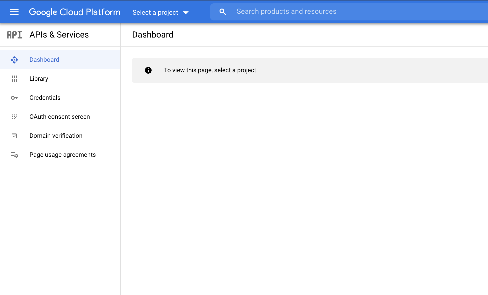

Click on the drop-down and it will open a project selection dialog. If you want
to use an existing project for Harvester you can, but creating a new project
for it might be a good idea to keep your services isolated from each other. To
create a new project you can click the "New Project" button in the top right of
the dialog.

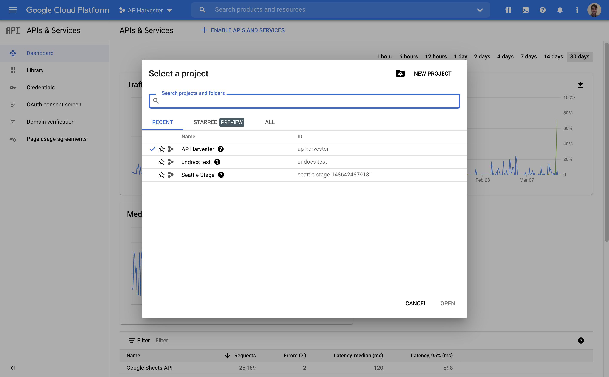

To create a new project you first have to give your project a name. Something
like "AP Harvester" or whatever will help you remember what this project is for
should be fine. (Note that the project ID, which by default is automatically
generated from the project name, will be included in the email address of the
service account used by Harvester, so choose something reasonable.) You also
have the option to choose a location for the project; unless you have your own
project organization system in the Google Cloud Platform you should be fine
with the default option of "No organization".

Now you have a project that will contain all of your Harvester credentials! You
should end up at the project dashboard, which is where you started out, but
your new project should be selected in the project selection drop-down. It
should look like this:

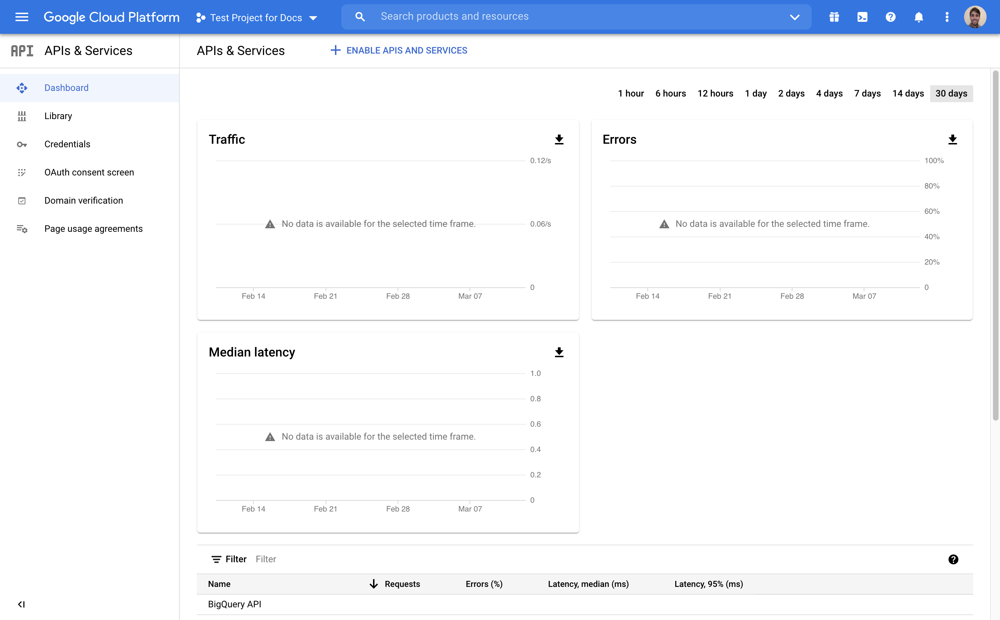

### Enable Google APIs

Now that you have a project you will need to enable a few Google APIs in the
project; namely, the Google Sheets API, the Google Drive API, and the Google
People API. You can enable APIs by clicking the "Enable APIs and Services"
button at the top of the project dashboard. That should take you to an API
search screen, where you can search for an individual API and hit the "Enable"
button.

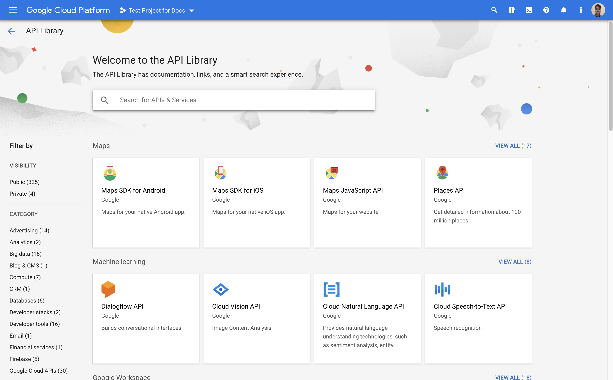

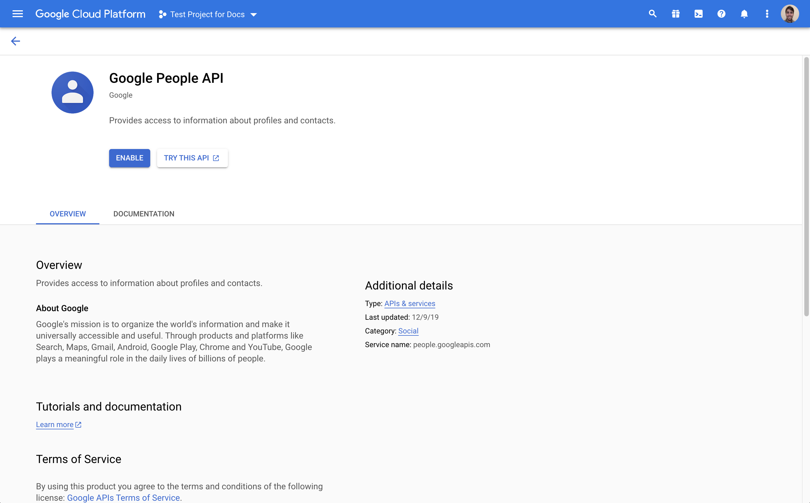

Once you enable the Google People API (search for "people"), the Google Sheets
API (search for "sheets"), and the Google Drive API (search for "drive") your
project will be ready to go.

## Service Account

Harvester uses a service account to access Google Sheets to manage data
collection projects, so the next step in our setup is creating a sevice
account. Head back to your project dashboard and navigate to the "Credentials"
section in the navbar on the left; then hit the "Create Credentials" buttons at
the top of the page and select the "Service account" option.

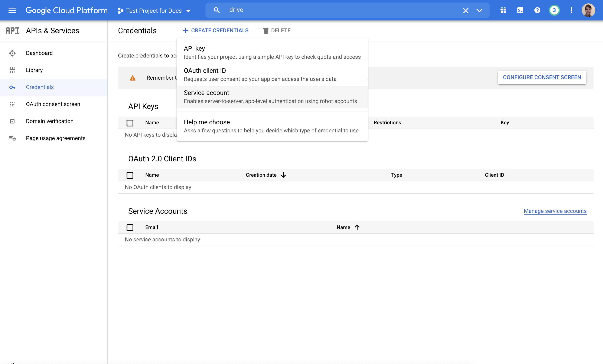

You will have to give your service account a name, which will also appear in
the service account's email address by default; something like "Harvester
Backend" should be fine. It might be worth giving the account a brief
description as well.

Next you have the option to grant the account some roles. This service account
will only be used as an identity to share documents with, so you don't need to
grant it any roles.

After that you can allow some users to act on behalf of the service account.
You likely won't need to do that, so you can skip it.

Now your service account should show up in the table of service accounts at the
bottom of the "Credentials" section of your project.

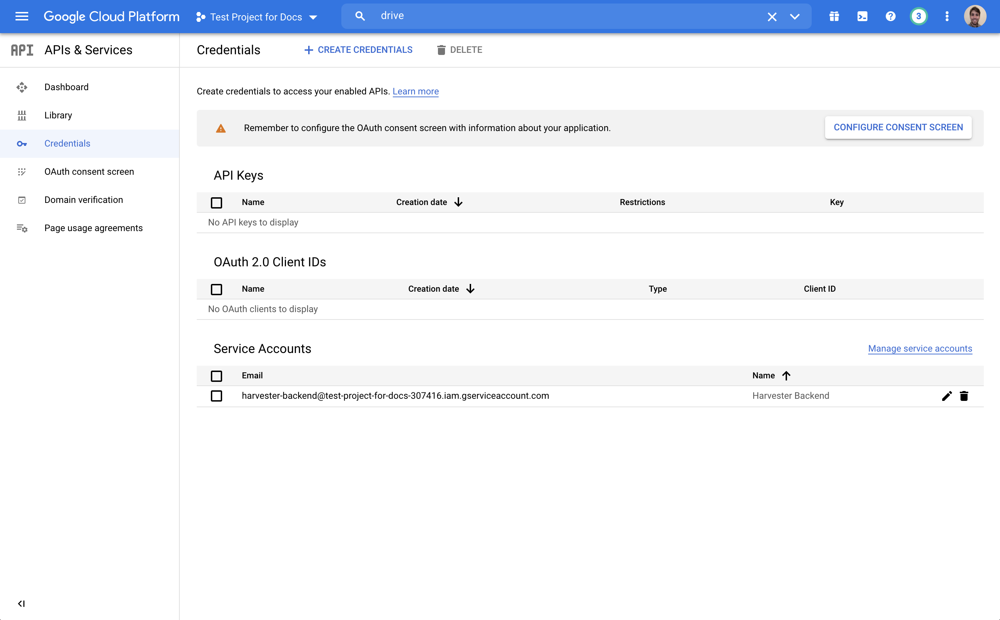

Click on the service account's email address to go to a detail view of the
service account. At the top you should see a "Keys" tab; click on that tab and
then hit the "Add key" button in the middle of the page and select "Create new
key".

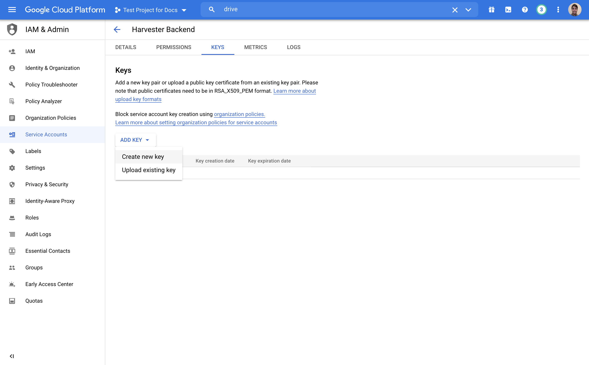

You will get a pop-up where you can select a key type; select JSON and hit
"Create". A JSON file containing your service account's credentials will be
downloaded to your computer; put the file in a safe place because you will need
it when you deploy Harvester.

## OAuth Authentication

If you want to set up Harvester with authentication and authorization enabled
you will have to create OAuth keys for it to use. Go back to the project's
"Credentials" section and hit the "Create Credentials" button at the top of the
page, just like we did to create a new service account, but this time select
"OAuth client ID".

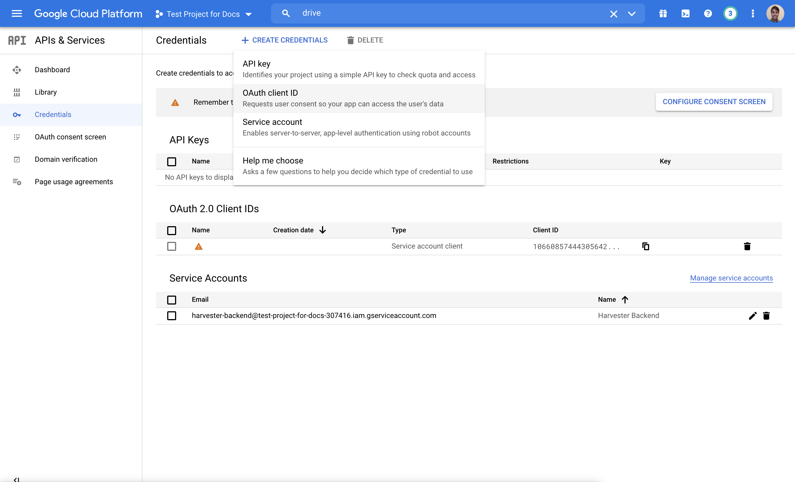

### Consent Screen

Before you are allowed to actually create your OAuth keys you have to create an
OAuth consent screen which will ask your users if they agree to allow Harvester
limited access to their accounts. Click the big blue "Create OAuth Consent
Screen" button.

The first thing you have to choose about your consent screen is the application
type; you should choose "External" so that the project will be available to any
user with a Google account.

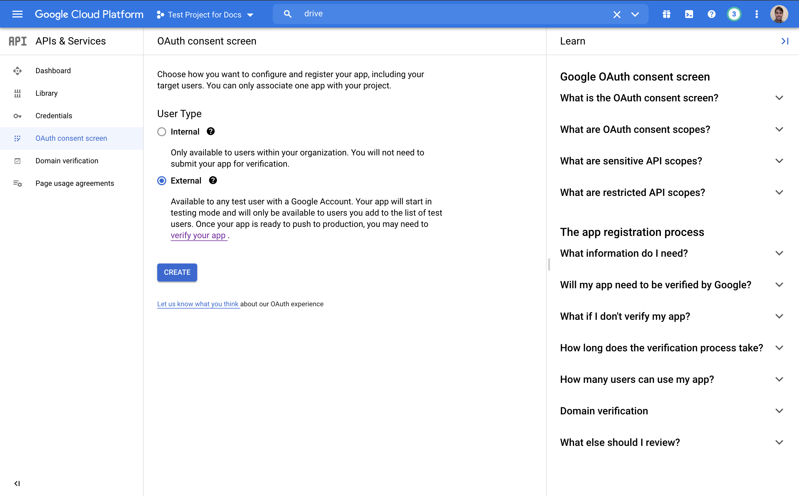

Next you need to set up some basic information about the OAuth consent screen,
including the name of your project, a logo for the project and a technical
support contact email. You can also include links to your project's home page,
privacy policy, and terms of service.

You will also have to include some authorized domains. These need to be domain
names (e.g., `ap.org` or `ap-harvester-demo.herokuapp.com`) that are allowed to
appear on your consent screen. You should include the domain where you will be
deploying Harvester as well as the domains used for any links you included
above.

Finally, you have to put in a developer contact email address and you can
save and continue.

The next step is to specify some scopes that your consent screen will ask
permission to access. Harvester requires two scopes to be accessible through
OAuth:

* `auth/userinfo.email`

* `auth/userinfo.profile`

You can add them by clicking the "Add or Remove Scopes" button, clicking
"Filter" above the scope list on the left, typing in "userinfo", and checking
the correct boxes from the remaining scopes.

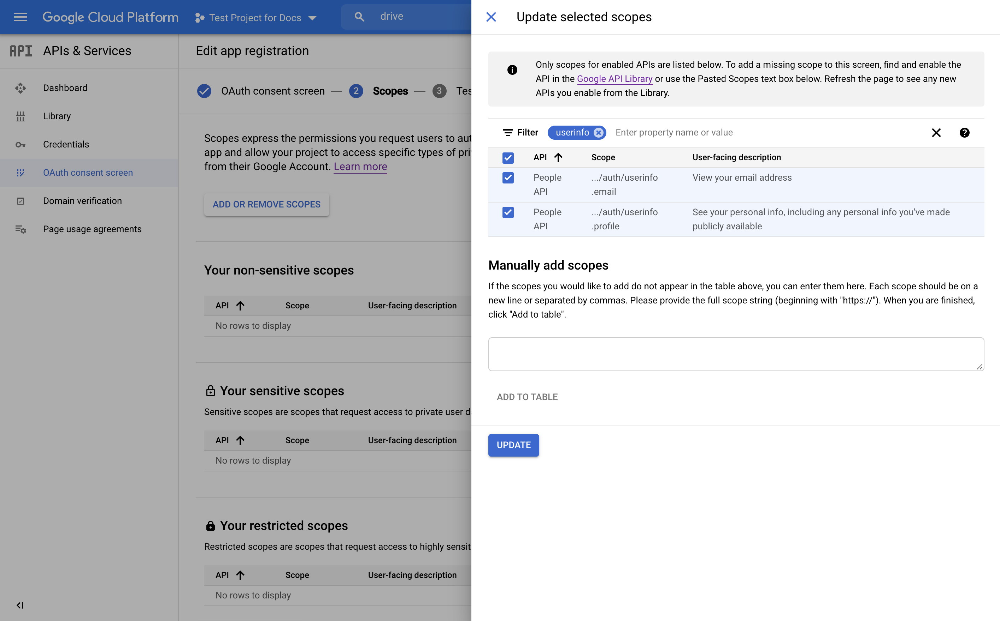

If you created your OAuth screen as an "external" project at the beginning,
your project will start out in "test" mode, meaning it is only available to
users who are explicitly added to the project. At the next step you have the
opportunity to add some users to the project; it's a good idea to add yourself
even if you're just going to publish the project right away. Click the "Add
Users" button, type your email address into the input field, and then make
sure to **click the "Add" button twice**; the first time should convert you
email to a pill box, and the second time should close the "Add users" dialog
and actually add you as a user.

That's all there is to setting up your consent screen; you can click through
the summary and return to your project's "Credentials" section.

### Client ID

Now that you have an OAuth consent screen you can return to the "Credentials" 
section of your project and continue creating an OAuth client ID.


Select an application type of "Web application", give it an identifiable name
like "AP Harvester", and add an "Authorized redirect URI" for use with
redirects from a web server (_not_ an "Authorized JavaScript origin"). You will
need to add a fully qualified URL to the path `/auth/oauth-google/callback`, so
if you are going to deploy the project to Heroku with the app name
`my-harvester`, you should add the redirect URI:

```shell
https://my-harvester.herokuapp.com/auth/oauth-google/callback
```

Once you hit "Create" you should get a pop-up with your OAuth credentials. Copy
both the client ID and the client secret and put them in a safe place. You will
need them when you deploy Harvester.

## Done!

And with that, all your Google credentials are ready! You should have the JSON
credentials for your service account and your OAuth client ID and secret ready
when you deploy Harvester.

[gcp-dashboard]: https://console.cloud.google.com/apis/dashboard
